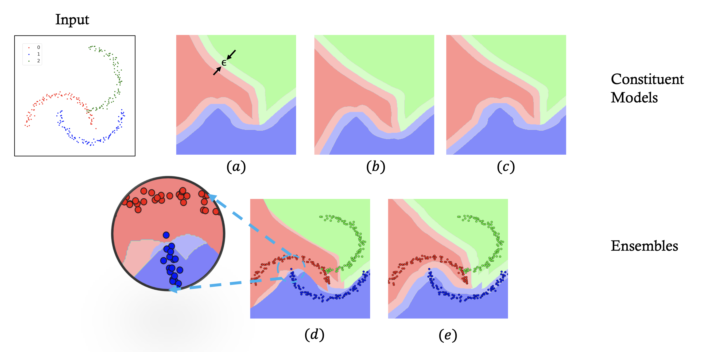

# On the Perils of Cascading Robust Classifiers
The repository supports the paper "On the Perils of Cascading Robust Classifiers."
This repository evaluates ensembles using different strategie (Cascading, Weighted Voting, Uniform Voting) with Kolter-Wong constituent models.
See more about the Kolter-Wong models here: https://github.com/locuslab/convex_adversarial/tree/2cd8149249b9e90383af10fc7e9b9fe90166813e

## What is this repository used for?
Cascading ensembles are a popular instance of black-box ensembles that appear to improve certified robust accuracies in practice. 
However, we find that the robustness certifier used by a cascading ensemble is unsound. 
This repository provides experimental support for cascading ensembles (unsound),  weighted voting ensembles (sound), and uniform weighted ensembles (sound). 
For all ensemble strategies, we used pre-trained and self-trained Kolter-Wong models.

## Visualization of Cascading Ensemble unsoundness

<p align = "center">

</p>
<p align = "left">
These figures are visualizing classification results of 2D points for constituent models (a-c) and the corresponding Cascading Ensemble (d) and Uniform Voting Ensemble (e). Regions with colors correspond to predictions (0: red, 1: blue, 2: green) made by the underlying model (or ensemble). Darker colors indicate that the accompanying robustness certification of the underlying model (or ensemble) returns 1 and lighter colors are for cases when the certification returns 0. All points receiving 1 for certifications (darker regions) are at least ε-away from the other classes in (a)-(c), i.e. certification is sound. This property is violated in (d), e.g. points from dark red regions are not ε-away from the blue region in the zoomed-in view on the left, but preserved in (e). Namely, voting ensembles are soundness-preserving while cascading ensembles are not.
</p>


## What is in this repository?
### Toy examples
`example/TwoMoon.ipynb` generates a two-dimensional toy example on different ensemble strategies for visualization. 

### Models
`/models/seq_trained/``: models pre-trained by Wong et al. under cascade training strategy. 
`/models/non_seq_trained/`: models trained by use in a non-sequential manner. 


### Scripts

#### Training constituent models

`train.sh` includes all the hyper-parameters and instructions needed for non-sequential training of a new constituent model, given the model type and epsilon value.  
Interntally, `train.sh` uses `example/mnist.py` and `example/cifar.py` for training new models. 

#### Evaluating constituent models
`eval.sh` includes all the hyper-parameters and instructions needed for evaluating a given constituent model. 
Internally, `eval.sh` uses `example/evaluate.py` for evaluating models. 
For a given constituent model evaluatued using either train or test dataset, it generates data files with one row for every sample in the dataset of the form  `(index , predicted label, correct label, is certified?)`
The pre-generated evaluation results are saved in the `evalData` folder. 

#### Evaluating ensembles
`vote.sh` includes the instructions for evaluating ensembles. Internally, `vote.sh` uses `example/voting.py` that  uses the evaluated results of the models in the `evalData' folder to calculate the ensemble results based on different ensemble strategies.
The available strategies include Cascading (unsound), Uniform Voting (sound), and Weighted Voting (sound). 
The algorithm for learning the weights of the weighted voting ensemble is implemented in `example/voting.py`.

#### Other files
All the other files used for training and evaluating the models come from the GitHub page of "Provably robust neural networks" by Wong et al. at https://github.com/locuslab/convex_adversarial/tree/2cd8149249b9e90383af10fc7e9b9fe90166813e.


## How to reproduce the tables in the paper?
To reproduce the results in the paper, start with the models in the `models` directory or train new constituent models using `train.sh`. Then, use `eval.sh` to generate the results of evaluating each  constituent model in the ensemble. The generated evaluation data is already available in the directory `evalData`. Finally, use `vote.sh` to generate ensemble results for different  model types and ensembling strategies. 

## Pre-requisites

We use the following docker image from [NVIDIA](https://catalog.ngc.nvidia.com/orgs/nvidia/containers/pytorch) to train the model.
```
nvcr.io/nvidia/pytorch:21.02-py3
```

Some extra packages that do not come with the docker can be installed with `pip`. 

```
pip install scriptify
```

The computation of voting weights needs TensorFlow 2.x. We will provide a PyTorch implementation in the future. 
